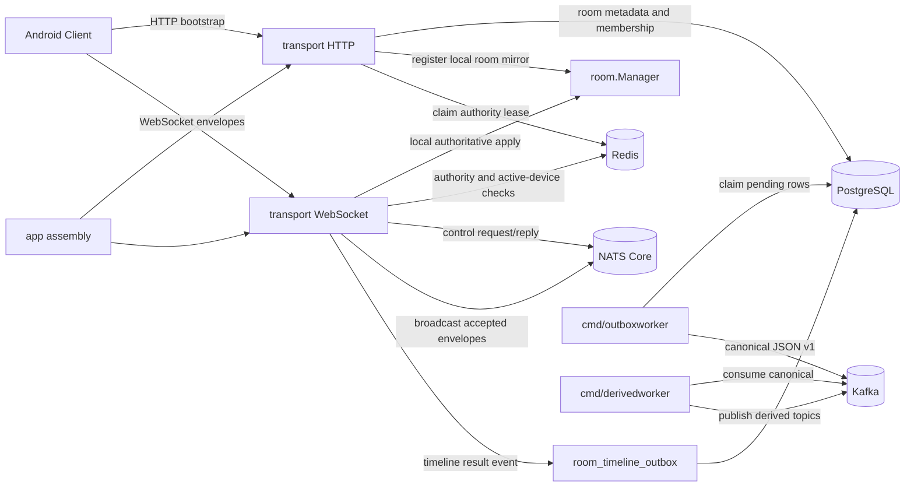
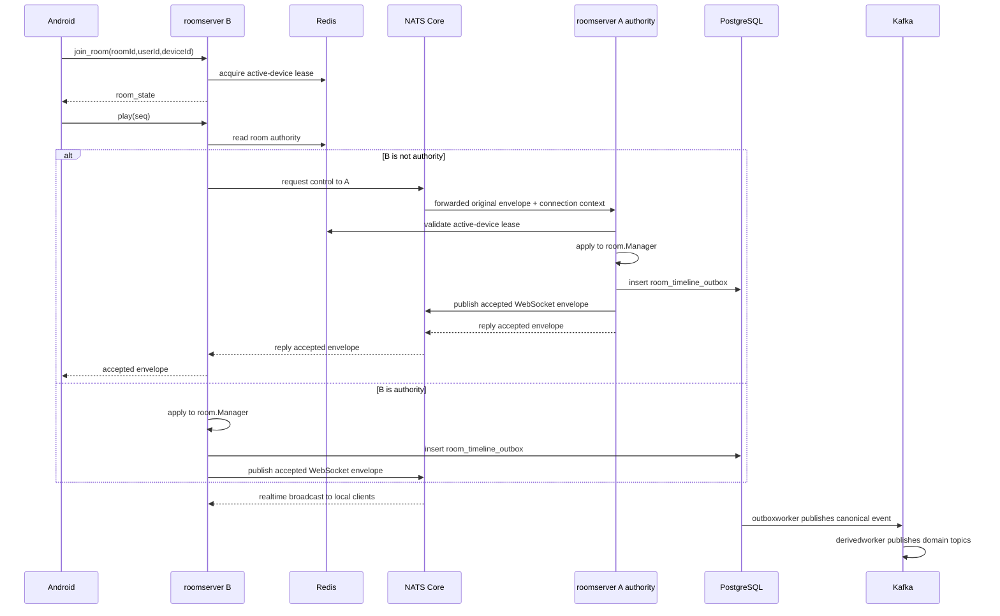

# Distributed Architecture

Phase 4 introduces the distributed room infrastructure MVP while keeping the public HTTP API and playback control payloads small. `local_process` remains supported. `distributed_authority` adds Redis authority leases, Redis active-device ownership, NATS Core internal routing, PostgreSQL outbox, and Kafka timeline topics.

## Architecture Mode

Android remains a session client:

- HTTP bootstrap creates or joins durable room business state.
- WebSocket `/ws` carries the live room session.
- `join_room.payload.deviceId` is required. Android generates one local device ID, stores it in `device.xml`, and excludes it from cloud backup and device transfer.
- The client consumes server WebSocket envelopes and does not know whether the current `roomserver` is authoritative.

Backend mode in Phase 4:

- `transport` owns HTTP and WebSocket protocol handling.
- `room` owns in-process room state for the authoritative instance.
- `cache` owns Redis latest snapshots, authority leases, and active-device leases.
- `eventbus` owns NATS Core broadcast and control request/reply.
- `store` owns PostgreSQL durable business state and outbox rows.
- `timeline` owns Kafka JSON v1 event shape, outbox dispatch, and derived-topic dispatch.
- `cmd/outboxworker` publishes outbox rows to the canonical Kafka topic.
- `cmd/derivedworker` derives control-result and membership topics from the canonical timeline.

## Module View

## Runtime Boundaries

| Boundary | Owner | Phase 4 role |
| --- | --- | --- |
| Local WebSocket connection | `roomserver` process | Never leaves process memory. |
| Latest room snapshot | Redis `wt:room:state:{roomId}:v1` | Recovery-oriented cache, not authority. |
| Room authority lease | Redis `wt:room:authority:{roomId}:v1` | Identifies the instance allowed to mutate room playback state. |
| Active device lease | Redis `wt:room:active_device:{roomId}:{userId}:v1` | Guards one active client device per room user. |
| Durable room business state | PostgreSQL | Rooms, members, media, users, progress. |
| Reliable Kafka compensation | PostgreSQL outbox | Pending canonical timeline events. |
| Durable timeline | Kafka `wt.room.timeline.v1` | Accepted/rejected control and membership result log. |
| Derived topics | Kafka | `wt.room.control_result.v1`, `wt.room.membership.v1`. |
| Realtime internal routing | NATS Core | Broadcast fan-out and non-authority control request/reply. |

## Control Flow

## Data Flows

Create room:

1. Android calls `POST /rooms`.
2. HTTP service writes room and host membership to PostgreSQL.
3. Runtime registers a local room mirror.
4. In `distributed_authority`, current instance tries to claim Redis authority.
5. Redis latest room snapshot is written best-effort.

Join room:

1. Android calls `POST /rooms/{roomCode}/join`.
2. PostgreSQL membership is created or reactivated.
3. Runtime registers a local room mirror and tries authority claim.
4. WebSocket `join_room` follows.

WebSocket join:

1. Client sends `roomId`, `userId`, and required `deviceId`.
2. Server verifies token user and active PostgreSQL membership.
3. In `distributed_authority`, server acquires or refreshes Redis active-device lease.
4. Server joins the process-local connection table and sends `room_state`.

Local authoritative control:

1. Server validates identity, active-device lease, authority lease, seq, dedup, and rate limit.
2. `room.Manager` applies the state transition.
3. Server writes Redis latest snapshot and PostgreSQL outbox event.
4. Server broadcasts the accepted WebSocket envelope locally and through NATS.

Non-authority control forwarding:

1. Ingress instance validates the source active-device lease.
2. Ingress reads Redis authority.
3. Ingress forwards the original envelope plus `instanceId`, `deviceId`, and `connectionId` over NATS request/reply.
4. Authority instance validates authority and active-device lease, applies or rejects, and replies.
5. Accepted results are still broadcast through NATS to all roomserver instances.

Active-device switch:

- Phase 4 externalizes active-device ownership to Redis.
- Same `deviceId` may refresh ownership with a newer `connectionId`.
- A different `deviceId` conflicts unless the existing lease expires or is released by matching `deviceId + connectionId`.

Kafka outbox delivery:

1. Authority writes `room_timeline_outbox` after accepted/rejected controls and membership changes.
2. `outboxworker` claims pending rows with `FOR UPDATE SKIP LOCKED`.
3. Successful Kafka publish marks rows `published`.
4. Failure increments attempts, stores `last_error`, and schedules `next_attempt_at`.

Derived topics:

1. `derivedworker` consumes `wt.room.timeline.v1`.
2. Control events publish to `wt.room.control_result.v1`.
3. Membership events publish to `wt.room.membership.v1`.

Realtime fan-out:

1. Accepted WebSocket envelopes publish to NATS Core broadcast subject.
2. Every roomserver subscribes directly to the subject, without queue groups.
3. Subscribers drop their own `instanceId`.
4. Remote events are delivered only to local WebSocket clients for that room and do not mutate local authority state.

## Not Phase 4 Goals

- Kafka is not the online broadcast final hop.
- Kafka is not the command ingress log.
- JetStream is not enabled.
- Automatic authority takeover after lease expiry is not implemented.
- Distributed seek rate-limit, distributed dedup, and full presence are not complete.
- WebSocket connection objects never move between instances.
