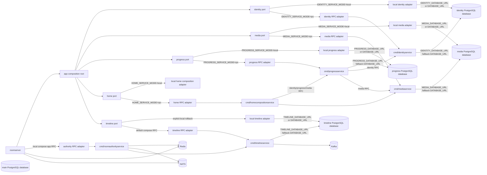
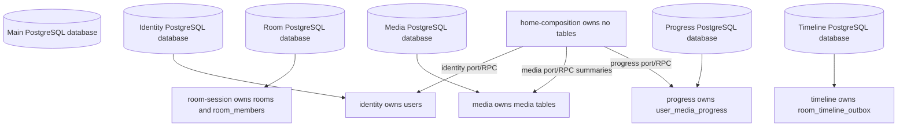
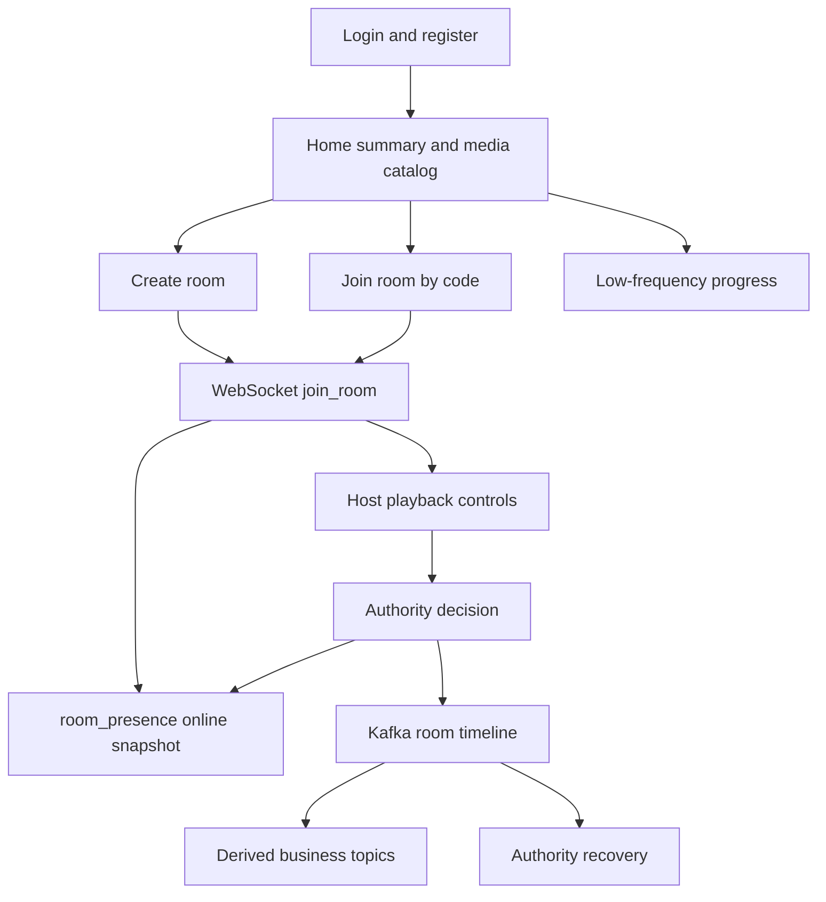
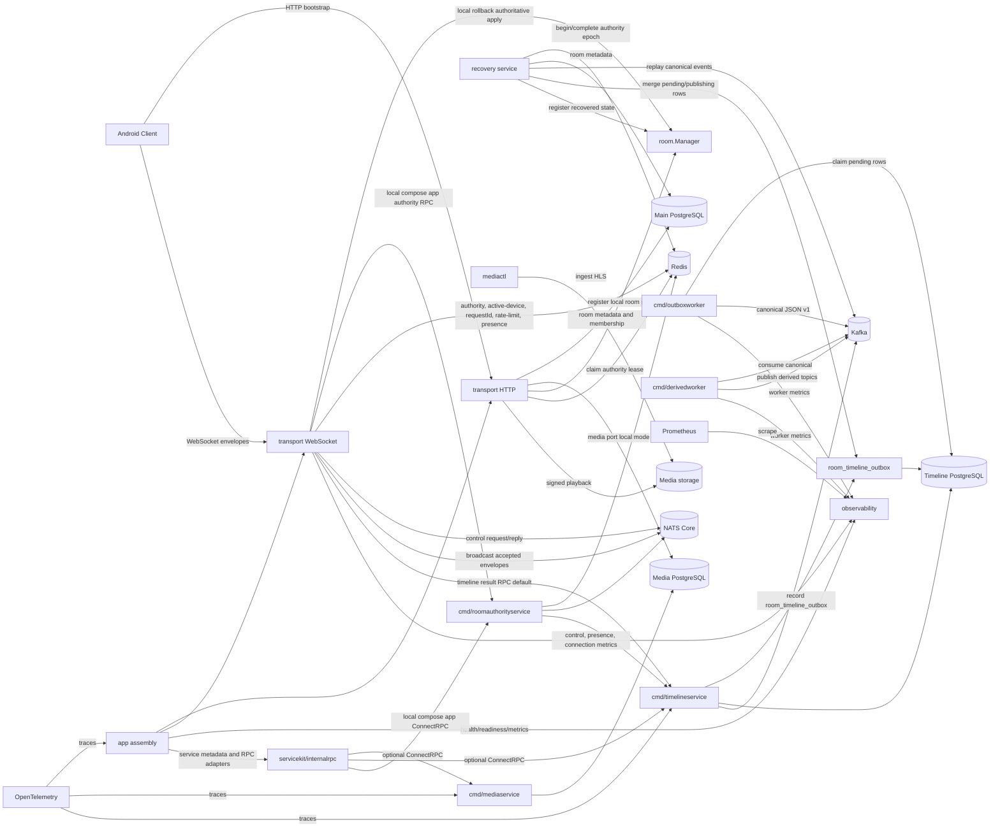
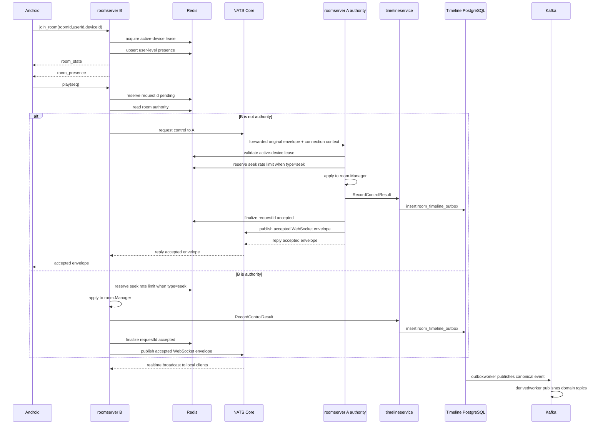
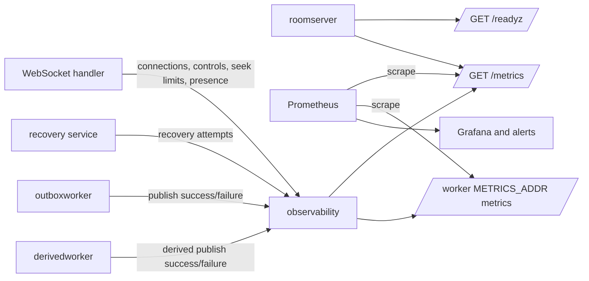
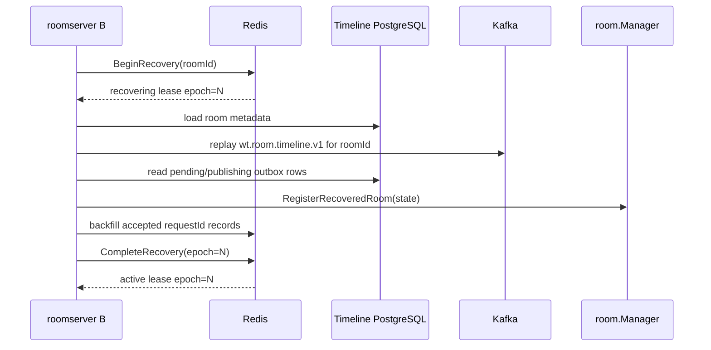
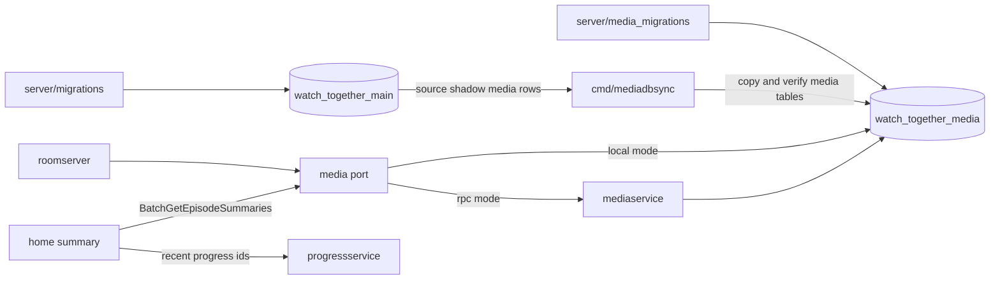
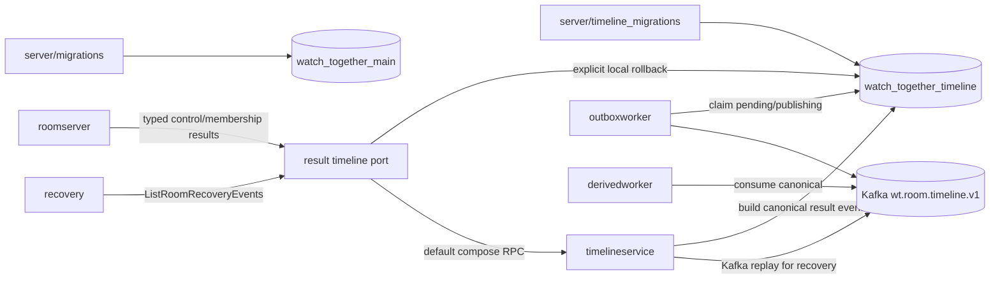

# Distributed Architecture

Phase 4 introduced the distributed room infrastructure MVP while keeping the public HTTP API and playback control payloads small. `local_process` remains supported. `distributed_authority` adds Redis authority leases, Redis active-device ownership, NATS Core internal routing, PostgreSQL outbox, and Kafka timeline topics. Phase 5 adds authority recovery and hardening: expired authority leases can be fenced, recovered from Kafka canonical timeline events, completed as a new active authority epoch, resumed without moving WebSocket connections, protected by Redis `requestId` idempotency, and exposed through user-level Redis presence. Phase 6 adds distributed seek rate limiting and observability: seek throttling moves to Redis in `distributed_authority`, `/readyz` reports dependency readiness, and `/metrics` exposes Prometheus metrics. Phase 7 adds the service foundation: servicekit, internal ConnectRPC contracts, optional media/timeline service skeletons, OpenTelemetry tracing, static service discovery, and logical database ownership design. Phase 8 makes the service pilot verifiable: generated typed ConnectRPC contracts replace dynamic `Struct` RPC payloads for media/timeline, the optional RPC services can be run through a compose `rpc-pilot` profile, and database ownership is enforced by a machine-readable registry plus architecture tests. Phase 9 turns `media` into the first database-boundary pilot. Phase 10 adds the timeline database boundary. Phase 11 makes timeline a default service-family boundary in compose. Phase 12 moves canonical result timeline semantics into `cmd/timelineservice`. Phase 13 designs `room-authority-service`, Phase 14 adds a non-default authority RPC pilot in `rpc-pilot`, Phase 15 hardens that pilot, and Phase 16 makes local compose `app` the recommended full-RPC development path for media, timeline, and authority. Phase 17/18 begins the business vertical-slice service route with `cmd/identityservice`; Phase 19 adds `cmd/roomservice`; Phase 20 adds `cmd/progressservice`, `cmd/homecompositionservice`, and `PROGRESS_DATABASE_URL`; Phase 21 adds `ROOM_DATABASE_URL` and moves room lifecycle/recovery metadata behind room RPC; Phase 22 adds `IDENTITY_DATABASE_URL` and removes the home SQL read model; Phase 23 turns the full-RPC multi-database compose path into a repeatable migration and smoke baseline; Phase 24 adds the production authority RPC canary; Phase 25 moves authority decisions into `authority.Engine` and makes production compose default to authority RPC; Phase 26 adds `cmd/apigateway`, routes public REST through it, keeps `/ws` on `roomserver`, and stabilizes the full-RPC smoke startup order. Bare `go run ./cmd/roomserver` still defaults to local adapters.

## Architecture Mode

Android remains a session client:

- HTTP bootstrap creates or joins durable room business state.
- WebSocket `/ws` carries the live room session.
- `join_room.payload.deviceId` is required. Android generates one local device ID, stores it in `device.xml`, and excludes it from cloud backup and device transfer.
- The client consumes server WebSocket envelopes and does not know whether the current `roomserver` is authoritative.
- Android prefers `room_presence.onlineCount` for online display and falls back to membership estimates when presence is absent.

Backend mode in `distributed_authority`:

- `transport` owns HTTP and WebSocket protocol handling.
- `room` owns in-process room state for the authoritative instance.
- `cache` owns Redis latest snapshots, authority leases, active-device leases, control request idempotency, distributed seek rate limiting, and user-level presence.
- `eventbus` owns NATS Core broadcast and control request/reply.
- `store` owns PostgreSQL durable business state implementations under context ownership rules.
- `timeline` owns Kafka JSON v1 event shape, timeline RPC adapters, outbox dispatch, and derived-topic dispatch.
- `cmd/timelineservice` is the default compose RPC entrypoint for timeline recording and room event reads.
- `cmd/outboxworker` is a timeline-owned worker that publishes outbox rows to the canonical Kafka topic.
- `cmd/derivedworker` is a timeline-owned projection worker that derives control-result and membership topics from the canonical timeline.
- `recovery` owns authority takeover, Kafka replay, unpublished outbox merge, and recovered `room.Manager` registration.
- `observability` owns readiness snapshots, Prometheus metrics, and worker metric hooks.
- `servicekit` owns internal request metadata, deadline, service identity, and internal auth conventions.
- `internalrpc` owns ConnectRPC server/client helpers for local/RPC dual-mode adapters.
- `telemetry` owns OpenTelemetry tracing setup and propagation.
- `cmd/apigateway` is the default public REST/BFF edge in compose; `cmd/roomserver` is the default WebSocket/session gateway.
- `cmd/identityservice`, `cmd/roomservice`, `cmd/mediaservice`, `cmd/progressservice`, `cmd/homecompositionservice`, `cmd/timelineservice`, and `cmd/roomauthorityservice` are the default local compose app RPC services.
- `cmd/roomservice` owns room metadata, membership, lifecycle persistence, recoverable-room scans, and room runtime bootstrap reads.
- `internal/rpcgen/v1` contains generated typed internal RPC messages and ConnectRPC client/handler code.

## Service Evolution Architecture

Phase 7 is not a full microservice split. Phase 8 keeps that constraint but hardens the pilot. Phase 9 adds a database-boundary pilot for media, Phase 10 adds the same database-boundary pilot for timeline outbox storage, Phase 11 makes timeline RPC the default compose path, Phase 12 gives `cmd/timelineservice` ownership of canonical result event construction, Phase 14 adds `cmd/roomauthorityservice` to `rpc-pilot`, Phase 15 hardens that authority RPC pilot, Phase 16 switches the local compose `app` path to full RPC, Phase 17/18 adds `cmd/identityservice`, Phase 19 adds `cmd/roomservice`, Phase 20 adds progress/home composition services plus a progress database boundary, Phase 21 adds a room database boundary plus lifecycle/recovery room RPC, Phase 22 adds the identity database boundary while removing the home SQL read model, Phase 23 adds a repeatable full-RPC multi-database smoke gate, Phase 24 adds the production authority canary, and Phase 25 makes `cmd/roomauthorityservice` the production default authority RPC service. Android HTTP/WebSocket payloads remain unchanged. `IDENTITY_DATABASE_URL`, `ROOM_DATABASE_URL`, `MEDIA_DATABASE_URL`, `PROGRESS_DATABASE_URL`, and `TIMELINE_DATABASE_URL` are optional database-boundary URLs; compose app/prod set identity/room/media/progress/timeline URLs on their owning services while keeping roomserver on RPC. In local compose `app`, `ROOMSERVER_IDENTITY_SERVICE_MODE`, `ROOMSERVER_ROOM_SERVICE_MODE`, `ROOMSERVER_MEDIA_SERVICE_MODE`, `ROOMSERVER_PROGRESS_SERVICE_MODE`, `ROOMSERVER_HOME_SERVICE_MODE`, `ROOMSERVER_TIMELINE_SERVICE_MODE`, and `ROOMSERVER_AUTHORITY_SERVICE_MODE` default to `rpc`; roomserver probes `identity_rpc`, `room_rpc`, `media_rpc`, `progress_rpc`, `home_rpc`, `timeline_rpc`, and `authority_rpc` through each service `/readyz`. Production compose also defaults authority RPC with `AUTHORITY_SERVICE_ADDR=http://roomauthorityservice:8090`; explicit rollback sets `AUTHORITY_SERVICE_MODE=local`, `ROOM_RUNTIME_MODE=local_process`, and `WS_CROSS_INSTANCE_BROADCAST_ENABLED=false`. Bare single-process debugging still uses local config defaults. `AUTHORITY_LEASE_INSTANCE_ID` is the Redis authority lease owner used by the authority service path. The `.proto` files under `server/api/internal/v1` are the source contracts for implemented internal RPC; generated Go code lives under `server/internal/rpcgen/v1`.

## Database Ownership

Phase 7 keeps one PostgreSQL database and introduces logical ownership boundaries. Phase 8 makes those boundaries testable. Phase 9 gives `media` its own PostgreSQL database boundary when `MEDIA_DATABASE_URL` is configured. Phase 10 gives `timeline` its own PostgreSQL database boundary when `TIMELINE_DATABASE_URL` is configured. Phase 20 gives `progress` its own PostgreSQL database boundary when `PROGRESS_DATABASE_URL` is configured and moves `/home/summary` to service composition by default. Phase 21 gives `room-session` its own PostgreSQL database boundary when `ROOM_DATABASE_URL` is configured and keeps room lifecycle/recovery metadata behind room RPC. Phase 22 gives `identity` its own PostgreSQL database boundary when `IDENTITY_DATABASE_URL` is configured and removes home-composition direct SQL reads. Table owners and cross-context access rules live in [Database Ownership](./database-ownership.md), with the CI source of truth in `server/internal/store/db_ownership.yaml`.

## Business Architecture

## Core Module View

## Runtime Boundaries

| Boundary | Owner | Phase 6 role |
| --- | --- | --- |
| Local WebSocket connection | `roomserver` process | Never leaves process memory. |
| Latest room snapshot | Redis `wt:room:state:{roomId}:v1` | Recovery-oriented cache, not authority. |
| Room authority lease | Redis `wt:room:authority:{roomId}:v1` | Identifies the instance allowed to mutate room playback state. |
| Active device lease | Redis `wt:room:active_device:{roomId}:{userId}:v1` | Guards one active client device per room user. |
| Control request idempotency | Redis `wt:room:control_request:{roomId}:{requestId}:v1` | Stores pending, accepted, and rejected request outcomes across instances. |
| Distributed seek rate limit | Redis `wt:room:control_rate:{roomId}:seek:v1` | Enforces seek min interval across authority takeovers and forwarded controls. |
| User-level presence | Redis `wt:room:presence:{roomId}:v1` | Runtime online occupancy by user; does not expose device, connection, or instance IDs. |
| Durable main business state | PostgreSQL | Users, rooms, members, and progress. |
| Media database boundary | `MEDIA_DATABASE_URL` PostgreSQL database | Optional Phase 9 database for media-owned tables; empty config falls back to the main database. |
| Timeline database boundary | `TIMELINE_DATABASE_URL` PostgreSQL database | Optional Phase 10 database for `room_timeline_outbox`; empty config falls back to the main database. |
| Reliable Kafka compensation | Timeline PostgreSQL outbox | Pending canonical timeline events. |
| Durable timeline | Kafka `wt.room.timeline.v1` | Accepted/rejected control and membership result log. |
| Derived topics | Kafka | `wt.room.control_result.v1`, `wt.room.membership.v1`. |
| Realtime internal routing | NATS Core | Broadcast fan-out and non-authority control request/reply. |
| Recovery replay | Kafka + timeline outbox | Rebuilds authority state after an expired authority lease. |
| Monitoring | `observability` + Prometheus | `/healthz`, `/readyz`, `/metrics`, and worker metric hooks. |
| Service metadata | `servicekit` | Request id, service name/version, deadline, internal auth, and trace metadata conventions. |
| Internal RPC | ConnectRPC over HTTP | Local compose app defaults identity, room, media, timeline, and authority to RPC; Android protocol remains unchanged. |
| Database ownership | PostgreSQL databases + docs | Main, optional media, and optional timeline databases keep owner rules and cross-context access checks. |
| Tracing | OpenTelemetry | Optional trace spans across HTTP, WebSocket control, Redis, NATS, Kafka, RPC, and PostgreSQL. |

## Control Flow

## Monitoring Flow

## Recovery Flow

## Data Flows

Create room:

1. Android calls `POST /rooms`.
2. Room service validates the selected episode through the media port, either local `PostgresMediaStore` or `MediaInternalService`. In Phase 9 the local media store can use `MEDIA_DATABASE_URL`.
3. HTTP service writes room and host membership to PostgreSQL.
4. Runtime registers a local room mirror with media duration from the media port.
5. In `distributed_authority`, current instance tries to claim Redis authority.
6. Redis latest room snapshot is written best-effort.

Join room:

1. Android calls `POST /rooms/{roomCode}/join`.
2. PostgreSQL membership is created or reactivated.
3. Room service loads media detail through the media port for runtime bootstrap.
4. Runtime registers a local room mirror and tries authority claim.
5. WebSocket `join_room` follows.

WebSocket join:

1. Client sends `roomId`, `userId`, and required `deviceId`.
2. Server verifies token user and active PostgreSQL membership.
3. In `distributed_authority`, server acquires or refreshes Redis active-device lease.
4. In `distributed_authority`, server upserts Redis user-level presence.
5. Server joins the process-local connection table and sends `room_state`.
6. Server sends a `room_presence` snapshot to the joined client and broadcasts a fresh snapshot to other local and remote clients.

Local authoritative control:

1. Server validates identity, active-device lease, authority lease, requestId idempotency, seq, dedup, and rate limit.
2. `room.Manager` applies the state transition.
3. Server performs a final Redis authority epoch check.
4. Server records the timeline result before any accepted broadcast. In Phase 12 compose this goes through `TimelineInternalService.RecordControlResult`; explicit local rollback uses the same timeline-owned builder in process.
5. Server finalizes Redis requestId as accepted and writes Redis latest snapshot.
6. Server broadcasts the accepted WebSocket envelope locally and through NATS.
7. If the timeline RPC or explicit local outbox write fails in `distributed_authority`, the accepted envelope is not broadcast, accepted requestId idempotency is not written, state is rolled back, and the client receives `room timeline unavailable` or current `room_state`.

Distributed seek rate limiting:

1. `local_process` keeps process-local seek limiting.
2. `distributed_authority` reserves `wt:room:control_rate:{roomId}:seek:v1` before applying seek.
3. A rate-limited seek returns current `room_state`, finalizes the request as rejected, and does not broadcast an accepted seek.
4. If apply later fails, the matching Redis reservation token is released.

Non-authority control forwarding:

1. Ingress instance reserves Redis requestId and validates the source active-device lease.
2. Ingress reads Redis authority and authority epoch.
3. Ingress forwards the original envelope plus `instanceId`, `deviceId`, `connectionId`, and expected epoch over NATS request/reply.
4. Authority instance validates authority and active-device lease before apply and again before reply.
5. Accepted results are recorded through timeline RPC by default, finalized in Redis idempotency, and broadcast through NATS to all roomserver instances.
6. Ingress drops stale-epoch replies and returns `room authority unavailable` or the current snapshot instead of accepting late old-authority results.
7. If the authority timeline recorder fails, ingress receives `room timeline unavailable`; the authority state is rolled back and no accepted broadcast is emitted.

Active-device switch:

- `distributed_authority` externalizes active-device ownership to Redis.
- Same `deviceId` may refresh ownership with a newer `connectionId`.
- A different `deviceId` conflicts unless the existing lease expires or is released by matching `deviceId + connectionId`.

User-level presence:

1. `join_room` success upserts Redis presence and emits `room_presence`.
2. Heartbeat acks refresh presence at `PRESENCE_REFRESH_INTERVAL_MS`.
3. `leave_room`, disconnect, active-device lease loss, and device switch release only matching `deviceId + connectionId`.
4. Presence broadcasts expose only `roomId`, `onlineCount`, `members`, `reason`, and `serverTimeMs`.
5. Kafka does not store online presence.

Kafka outbox delivery:

1. Authority writes `room_timeline_outbox` after accepted/rejected controls and membership changes.
2. In Phase 11 compose, authority reaches that table through `cmd/timelineservice` RPC.
3. `outboxworker` claims pending rows with `FOR UPDATE SKIP LOCKED`.
4. Successful Kafka publish marks rows `published`.
5. Failure increments attempts, stores `last_error`, and schedules `next_attempt_at`.

Derived topics:

1. `derivedworker` is a timeline-owned projection worker and consumes `wt.room.timeline.v1`.
2. Control events publish to `wt.room.control_result.v1`.
3. Membership events publish to `wt.room.membership.v1`.

Progress:

1. Android calls `PUT /me/media-progress/{mediaItemId}`.
2. `roomserver` calls the progress port; compose app/prod default to `ProgressInternalService.UpdateProgress`.
3. `cmd/progressservice` validates the user through identity RPC and validates the episode through media RPC before writing.
4. `PostgresProgressStore` writes and reads only `user_media_progress`; it does not query `users` or media tables directly.
5. In local rollback mode, the same `progress.Service` can use local identity/media adapters and `PROGRESS_DATABASE_URL` or `DATABASE_URL`.

Home summary:

1. Android calls `GET /home/summary`.
2. `roomserver` calls the home port; compose app/prod default to `HomeCompositionInternalService.GetHomeSummary`.
3. `cmd/homecompositionservice` loads the profile from identity RPC, recent progress from progress RPC, and title/cover summaries from media RPC.
4. Missing media summaries are skipped, preserving the old inner-join behavior.
5. There is no home SQL read model fallback; `HOME_SERVICE_MODE=local` still composes through local identity/progress/media ports.

Realtime fan-out:

1. Accepted WebSocket envelopes publish to NATS Core broadcast subject.
2. Every roomserver subscribes directly to the subject, without queue groups.
3. Subscribers drop their own `instanceId`.
4. Remote events are delivered only to local WebSocket clients for that room and do not mutate local authority state.

Observability:

1. `/healthz` stays a lightweight liveness endpoint and keeps runtime headers.
2. `/readyz` reports configured dependency readiness for PostgreSQL, media PostgreSQL, timeline PostgreSQL, Redis, NATS, Kafka, outbox, and recovery.
3. `/metrics` exposes Prometheus metrics when `METRICS_ENABLED=true`.
4. `roomserver` serves metrics on the main HTTP server; `outboxworker` and `derivedworker` serve metrics when `METRICS_ADDR` is set.
5. Metrics include WebSocket connections, control accepted/rejected counts, seek rate-limit decisions, NATS room events, authority recovery attempts, presence online gauge, and worker publish results.

Authority recovery:

1. A join, room state request, control event, or low-frequency scanner discovers a missing or expired authority lease.
2. One instance enters Redis `status=recovering` and increments the authority `epoch`.
3. The instance loads room metadata from PostgreSQL.
4. The instance replays `room.control.accepted` events from `wt.room.timeline.v1`.
5. The instance merges same-room `pending` and `publishing` timeline outbox events by event id through the timeline port/RPC.
6. The instance registers recovered playback state in local `room.Manager`.
7. The instance backfills recent accepted Redis requestId records from recovered events.
8. Redis authority is completed as `status=active` for the new epoch.
9. NATS control forwarding and broadcast messages carry `authorityEpoch`; stale epoch messages are rejected or dropped.

## Service Foundation Flow

1. `internal/app` chooses local or RPC adapters for identity, room metadata, media, progress, home composition, timeline, and authority based on `IDENTITY_SERVICE_MODE`, `ROOM_SERVICE_MODE`, `MEDIA_SERVICE_MODE`, `PROGRESS_SERVICE_MODE`, `HOME_SERVICE_MODE`, `TIMELINE_SERVICE_MODE`, and `AUTHORITY_SERVICE_MODE`.
2. Local adapters keep the current PostgreSQL/Kafka code path.
3. RPC adapters call `cmd/identityservice`, `cmd/roomservice`, `cmd/mediaservice`, `cmd/progressservice`, `cmd/homecompositionservice`, `cmd/timelineservice`, or `cmd/roomauthorityservice` through ConnectRPC.
4. `servicekit` attaches request id, service name/version, deadline, internal auth, and trace metadata.
5. OpenTelemetry tracing is opt-in and does not change Android payloads.
6. `room-session -> media/identity`, `progress -> media/identity`, and `home-composition -> media/progress/identity` now cross through ports/RPC in the default compose path.
7. `roomserver` create/join/detail/leave/member-check calls can cross the room RPC boundary; lifecycle cleanup and recovery scanner store hooks remain local rollback work until a later lifecycle RPC phase.
8. `timeline` recorder failures, including timeline RPC timeout, unavailable errors, or explicit local timeline database failure, are fail-closed for accepted controls.

## Phase 9 Media Database Flow

`cmd/mediadbsync` copies `media_tags`, `media_seasons`, `media_episodes`, `media_season_tags`, and `media_episode_variants` with stable ids and timestamps. `--verify-only` checks row counts and deterministic content hashes.

## Phase 12 Timeline Result Ownership Flow

Phase 12 keeps timeline as a service family and gives `cmd/timelineservice` ownership of result timeline semantics. `roomserver` still owns WebSocket connections, authority decisions, and client-visible envelopes, but default control and membership paths call typed result RPCs instead of constructing complete `TimelineEvent` values. `cmd/timelineservice` generates canonical event ids, event version, server occurrence time, payload JSON, and `room_timeline_outbox` rows. Recovery calls one feed, `ListRoomRecoveryEvents`, so Kafka canonical events and same-room `pending`/`publishing` outbox gaps are merged, deduped, and sorted inside the timeline boundary.

Phase 12 does not merge timeline workers into `cmd/timelineservice`. The timeline boundary remains a service family: RPC API, outbox publisher worker, derived projection worker, timeline database, and Kafka topics. Kafka is still a result log, not a command ingress log. `room authority` is still in `roomserver`. The old main-database `room_timeline_outbox` table remains fallback/shadow data. When timeline RPC or explicit local timeline storage is unavailable, timeline writes fail closed: accepted controls are not broadcast, accepted request idempotency is not finalized, and recovery must not complete a new authority epoch from an unavailable recovery feed.

`pending` and `publishing` rows are recovery-gap state and must not be deleted by cleanup jobs. Published-row retention is a later operations decision.

## Phase 20 Progress And Home Composition

Phase 20 adds the progress and home vertical slices:

- `cmd/progressservice` exposes `ProgressInternalService` for update, single lookup, batch lookup, and recent progress listing.
- `cmd/homecompositionservice` exposes `HomeCompositionInternalService.GetHomeSummary`.
- `server/progress_migrations` owns the independent progress database schema for `user_media_progress`; it has no cross-database foreign keys to `users` or media tables.
- `cmd/progressdbsync` copies the old main-database progress shadow table into the progress database and supports `--dry-run` and `--verify-only`.
- Local compose `app` and production compose default `roomserver` to `PROGRESS_SERVICE_MODE=rpc` and `HOME_SERVICE_MODE=rpc`; `roomserver` does not receive `PROGRESS_DATABASE_URL` in RPC mode.
- `cmd/progressservice` uses identity and media ports/RPC before writing progress. `PostgresProgressStore` only reads/writes `user_media_progress`.
- `cmd/homecompositionservice` owns no core tables. It composes identity profile, recent progress, and media summaries through RPC; missing media summaries are skipped.

`PROGRESS_SERVICE_MODE=local`, `HOME_SERVICE_MODE=local`, and `ROOMSERVER_PROGRESS_DATABASE_URL` remain explicit rollback/debug paths. Android HTTP routes and response JSON are unchanged.

## Not Current Goals

- Kafka is not the online broadcast final hop.
- Kafka is not the command ingress log.
- JetStream is not enabled.
- Device-level presence management and full multi-device UI are not complete.
- WebSocket connection objects never move between instances.
- A second PostgreSQL server/container is not required; the pilot uses a second database inside the existing PostgreSQL server/container.
- Kratos, go-zero, and go-kit are not adopted as the main framework.

Phase 23 shifts the immediate focus from adding new service slices to proving the existing full-RPC, multi-database baseline. `server/scripts/verify_phase23.ps1 -RunSmoke` applies all owner migrations, seeds deterministic media, exercises the Android-facing HTTP/WebSocket path, and checks that identity, room, progress, and timeline writes land in their owning databases instead of the main shadow tables. Phase 24 adds production authority RPC canary readiness. Phase 25 replaces the canary-only posture with a production default: `roomauthorityservice` starts by default, `roomserver` uses authority RPC, and local authority remains an explicit rollback mode. Any command inbox or command ingress remains a separate decision.

## Business Vertical-Slice Service Route

Current local compose app now runs `cmd/apigateway` for Android-facing REST and `cmd/roomserver` for WebSocket/session gateway duties. Public REST routes such as `/auth`, `/home`, `/media`, `/me/media-progress`, and `/rooms` go through `apigateway`; `/ws` still goes to `roomserver`. The gateway calls identity, room, media, progress, home, and authority through RPC and does not receive business database URLs. `roomserver` keeps WebSocket connections, send queues, heartbeat, local connection tables, NATS fan-out, and room runtime mirrors. When a room was created through the gateway and is missing from local roomserver memory, WebSocket join and room-state requests lazy-bootstrap room runtime state through room RPC plus the timeline recovery feed.

This route deliberately merges design and implementation work. New slices should continue to ship with the real Android-facing handler path unchanged, internal RPC/local adapters, compose wiring, owner-boundary updates, and a business smoke proving the user path. After Phase 26, the main remaining target-architecture gap is operational hardening and cleanup: production-like smoke confidence, stronger migration/backup runbooks, and eventual shadow-table removal after confidence is high.

## Phase 14 Room Authority RPC Pilot

Phase 13 adds the design boundary for `room-authority-service`; see [Room Authority Service Design](./room-authority-service-design.md). Phase 14 implements the internal authority RPC and `cmd/roomauthorityservice` for the `rpc-pilot` profile. Phase 15 hardens that pilot with dynamic readiness, authority RPC metrics, stable failure tests, and the explicit `AUTHORITY_LEASE_INSTANCE_ID` lease owner. Phase 16 promotes the same authority RPC path into the local compose `app` profile. Phase 24 adds production canary verification, and Phase 25 makes authority RPC the production compose default.

Current ownership remains:

- `apigateway` owns public REST/BFF routing in compose and calls business services through RPC.
- `roomserver` owns WebSocket ingress/egress, session bootstrap/lazy runtime recovery, local connection tables, client-visible envelopes, NATS realtime fan-out, and local rollback authority decisions.
- `identityservice` owns register/login/token verification/profile RPC in local compose `app`; compose app/prod give it `IDENTITY_DATABASE_URL` for the identity database, while the main `users` table remains only a shadow/rollback source for bare local fallback and `identitydbsync`.
- `roomservice` owns room metadata and membership RPC for create, join, detail, leave, active-member checks, lifecycle updates, and recovery bootstrap; compose app/prod give it `ROOM_DATABASE_URL` for the room database while the main room tables remain shadow/rollback data.
- `roomauthorityservice` owns authority control apply in local compose `app`, `rpc-pilot`, and production compose RPC mode through `authority.Engine`.
- `timelineservice` owns canonical result event generation, timeline outbox writes, and recovery feed composition.
- Redis stores authority leases, active-device leases, request idempotency, seek rate limit, latest snapshots, and presence.
- NATS remains realtime fan-out and internal control request/reply.
- Kafka remains the durable timeline result log, not command ingress.

The target design keeps `roomserver` as the client edge while moving authority decisions toward `roomId` actors. Phase 14 adds `authority.proto`, `cmd/roomauthorityservice`, and `AUTHORITY_SERVICE_MODE=rpc` for `rpc-pilot`; Phase 15 makes that pilot observable and readiness-gated. Phase 16 makes local compose `app` use `AUTHORITY_SERVICE_MODE=rpc`, with active `/readyz` probes for the authority RPC dependency. Phase 25 makes production compose use the same RPC boundary by default while retaining explicit local rollback.
