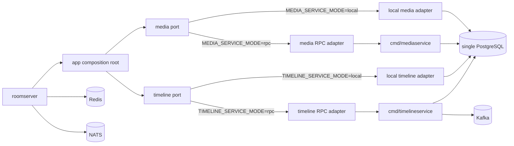
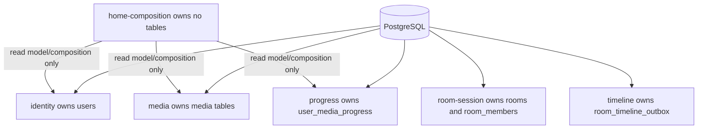
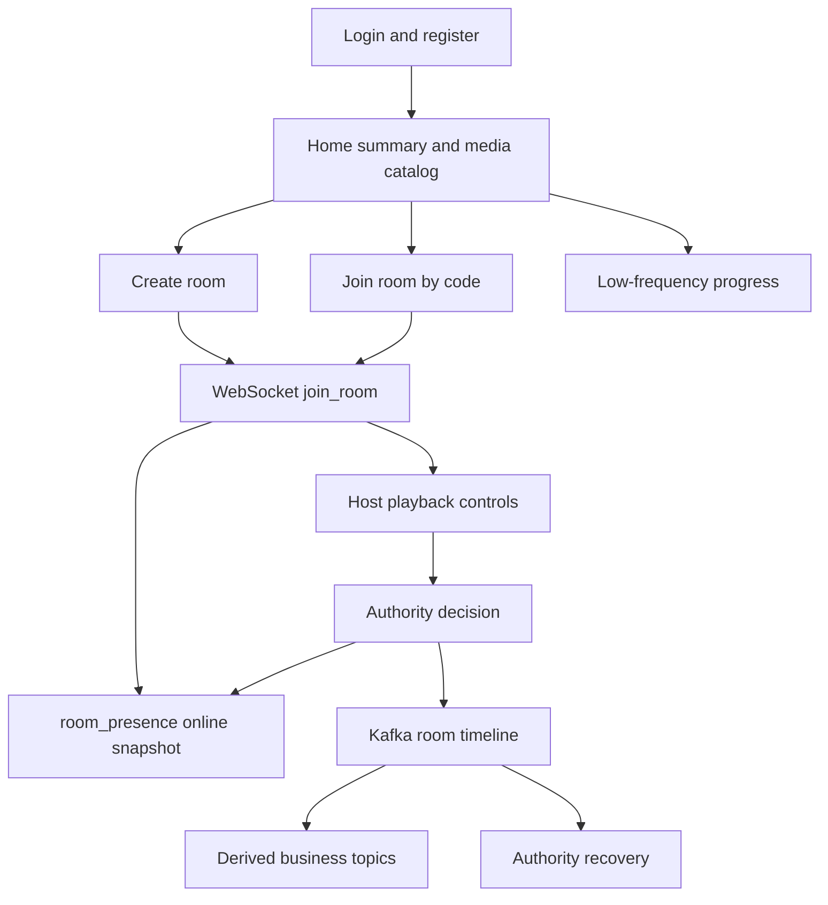
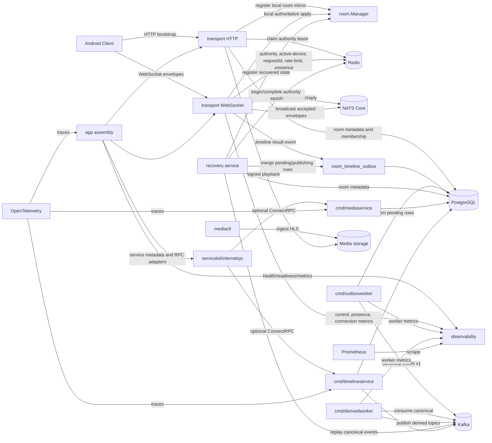
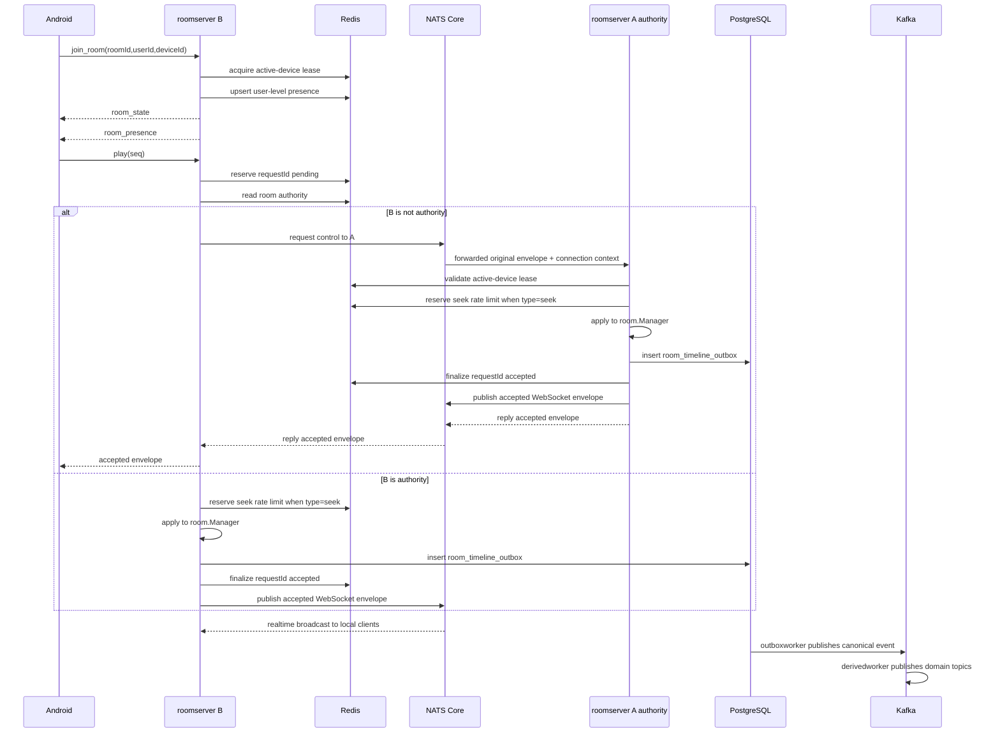
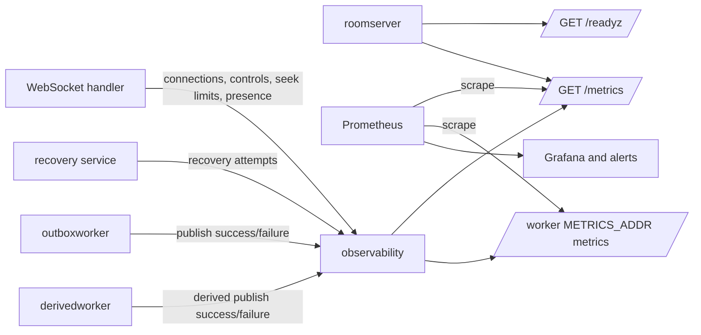
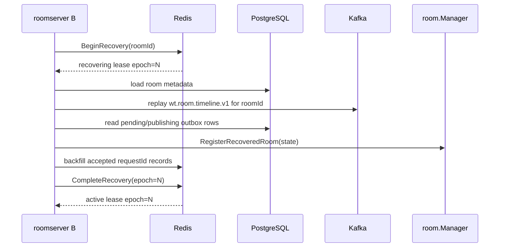

# Distributed Architecture

Phase 4 introduced the distributed room infrastructure MVP while keeping the public HTTP API and playback control payloads small. `local_process` remains supported. `distributed_authority` adds Redis authority leases, Redis active-device ownership, NATS Core internal routing, PostgreSQL outbox, and Kafka timeline topics. Phase 5 adds authority recovery and hardening: expired authority leases can be fenced, recovered from Kafka canonical timeline events, completed as a new active authority epoch, resumed without moving WebSocket connections, protected by Redis `requestId` idempotency, and exposed through user-level Redis presence. Phase 6 adds distributed seek rate limiting and observability: seek throttling moves to Redis in `distributed_authority`, `/readyz` reports dependency readiness, and `/metrics` exposes Prometheus metrics. Phase 7 adds the service foundation: servicekit, internal ConnectRPC contracts, optional media/timeline service skeletons, OpenTelemetry tracing, static service discovery, and logical database ownership design. Phase 8 makes the service pilot verifiable: generated typed ConnectRPC contracts replace dynamic `Struct` RPC payloads for media/timeline, the optional RPC services can be run through a compose `rpc-pilot` profile, and database ownership is enforced by a machine-readable registry plus architecture tests.

## Architecture Mode

Android remains a session client:

- HTTP bootstrap creates or joins durable room business state.
- WebSocket `/ws` carries the live room session.
- `join_room.payload.deviceId` is required. Android generates one local device ID, stores it in `device.xml`, and excludes it from cloud backup and device transfer.
- The client consumes server WebSocket envelopes and does not know whether the current `roomserver` is authoritative.
- Android prefers `room_presence.onlineCount` for online display and falls back to membership estimates when presence is absent.

Backend mode in `distributed_authority`:

- `transport` owns HTTP and WebSocket protocol handling.
- `room` owns in-process room state for the authoritative instance.
- `cache` owns Redis latest snapshots, authority leases, active-device leases, control request idempotency, distributed seek rate limiting, and user-level presence.
- `eventbus` owns NATS Core broadcast and control request/reply.
- `store` owns PostgreSQL durable business state and outbox rows.
- `timeline` owns Kafka JSON v1 event shape, outbox dispatch, and derived-topic dispatch.
- `cmd/outboxworker` publishes outbox rows to the canonical Kafka topic.
- `cmd/derivedworker` derives control-result and membership topics from the canonical timeline.
- `recovery` owns authority takeover, Kafka replay, unpublished outbox merge, and recovered `room.Manager` registration.
- `observability` owns readiness snapshots, Prometheus metrics, and worker metric hooks.
- `servicekit` owns internal request metadata, deadline, service identity, and internal auth conventions.
- `internalrpc` owns ConnectRPC server/client helpers for local/RPC dual-mode adapters.
- `telemetry` owns OpenTelemetry tracing setup and propagation.
- `cmd/mediaservice` and `cmd/timelineservice` are optional service skeletons for the first serviceization candidates.
- `internal/rpcgen/v1` contains generated typed internal RPC messages and ConnectRPC client/handler code.

## Service Evolution Architecture

Phase 7 is not a full microservice split. Phase 8 keeps that constraint but hardens the pilot. The default deployment still runs `roomserver` with local adapters. `MEDIA_SERVICE_MODE=rpc` and `TIMELINE_SERVICE_MODE=rpc` switch selected boundaries to the optional internal services. The `.proto` files under `server/api/internal/v1` are the source contracts; generated Go code lives under `server/internal/rpcgen/v1`.

## Database Ownership

Phase 7 keeps one PostgreSQL database and introduces logical ownership boundaries. Phase 8 makes those boundaries testable. Table owners and cross-context access rules live in [Database Ownership](./database-ownership.md), with the CI source of truth in `server/internal/store/db_ownership.yaml`.

## Business Architecture

## Core Module View

## Runtime Boundaries

| Boundary | Owner | Phase 6 role |
| --- | --- | --- |
| Local WebSocket connection | `roomserver` process | Never leaves process memory. |
| Latest room snapshot | Redis `wt:room:state:{roomId}:v1` | Recovery-oriented cache, not authority. |
| Room authority lease | Redis `wt:room:authority:{roomId}:v1` | Identifies the instance allowed to mutate room playback state. |
| Active device lease | Redis `wt:room:active_device:{roomId}:{userId}:v1` | Guards one active client device per room user. |
| Control request idempotency | Redis `wt:room:control_request:{roomId}:{requestId}:v1` | Stores pending, accepted, and rejected request outcomes across instances. |
| Distributed seek rate limit | Redis `wt:room:control_rate:{roomId}:seek:v1` | Enforces seek min interval across authority takeovers and forwarded controls. |
| User-level presence | Redis `wt:room:presence:{roomId}:v1` | Runtime online occupancy by user; does not expose device, connection, or instance IDs. |
| Durable room business state | PostgreSQL | Rooms, members, media, users, progress. |
| Reliable Kafka compensation | PostgreSQL outbox | Pending canonical timeline events. |
| Durable timeline | Kafka `wt.room.timeline.v1` | Accepted/rejected control and membership result log. |
| Derived topics | Kafka | `wt.room.control_result.v1`, `wt.room.membership.v1`. |
| Realtime internal routing | NATS Core | Broadcast fan-out and non-authority control request/reply. |
| Recovery replay | Kafka + PostgreSQL outbox | Rebuilds authority state after an expired authority lease. |
| Monitoring | `observability` + Prometheus | `/healthz`, `/readyz`, `/metrics`, and worker metric hooks. |
| Service metadata | `servicekit` | Request id, service name/version, deadline, internal auth, and trace metadata conventions. |
| Internal RPC | ConnectRPC over HTTP | Optional media/timeline RPC adapters; Android protocol remains unchanged. |
| Logical database ownership | PostgreSQL + docs | One database remains, but tables have context owners and cross-context access rules. |
| Tracing | OpenTelemetry | Optional trace spans across HTTP, WebSocket control, Redis, NATS, Kafka, RPC, and PostgreSQL. |

## Control Flow

## Monitoring Flow

## Recovery Flow

## Data Flows

Create room:

1. Android calls `POST /rooms`.
2. HTTP service writes room and host membership to PostgreSQL.
3. Runtime registers a local room mirror.
4. In `distributed_authority`, current instance tries to claim Redis authority.
5. Redis latest room snapshot is written best-effort.

Join room:

1. Android calls `POST /rooms/{roomCode}/join`.
2. PostgreSQL membership is created or reactivated.
3. Runtime registers a local room mirror and tries authority claim.
4. WebSocket `join_room` follows.

WebSocket join:

1. Client sends `roomId`, `userId`, and required `deviceId`.
2. Server verifies token user and active PostgreSQL membership.
3. In `distributed_authority`, server acquires or refreshes Redis active-device lease.
4. In `distributed_authority`, server upserts Redis user-level presence.
5. Server joins the process-local connection table and sends `room_state`.
6. Server sends a `room_presence` snapshot to the joined client and broadcasts a fresh snapshot to other local and remote clients.

Local authoritative control:

1. Server validates identity, active-device lease, authority lease, requestId idempotency, seq, dedup, and rate limit.
2. `room.Manager` applies the state transition.
3. Server performs a final Redis authority epoch check.
4. Server writes PostgreSQL outbox before any accepted broadcast.
5. Server finalizes Redis requestId as accepted and writes Redis latest snapshot.
6. Server broadcasts the accepted WebSocket envelope locally and through NATS.
7. If the outbox write fails in `distributed_authority`, the accepted envelope is not broadcast and the client receives an error or current `room_state`.

Distributed seek rate limiting:

1. `local_process` keeps process-local seek limiting.
2. `distributed_authority` reserves `wt:room:control_rate:{roomId}:seek:v1` before applying seek.
3. A rate-limited seek returns current `room_state`, finalizes the request as rejected, and does not broadcast an accepted seek.
4. If apply later fails, the matching Redis reservation token is released.

Non-authority control forwarding:

1. Ingress instance reserves Redis requestId and validates the source active-device lease.
2. Ingress reads Redis authority and authority epoch.
3. Ingress forwards the original envelope plus `instanceId`, `deviceId`, `connectionId`, and expected epoch over NATS request/reply.
4. Authority instance validates authority and active-device lease before apply and again before reply.
5. Accepted results are written to outbox, finalized in Redis idempotency, and broadcast through NATS to all roomserver instances.
6. Ingress drops stale-epoch replies and returns `room authority unavailable` or the current snapshot instead of accepting late old-authority results.

Active-device switch:

- `distributed_authority` externalizes active-device ownership to Redis.
- Same `deviceId` may refresh ownership with a newer `connectionId`.
- A different `deviceId` conflicts unless the existing lease expires or is released by matching `deviceId + connectionId`.

User-level presence:

1. `join_room` success upserts Redis presence and emits `room_presence`.
2. Heartbeat acks refresh presence at `PRESENCE_REFRESH_INTERVAL_MS`.
3. `leave_room`, disconnect, active-device lease loss, and device switch release only matching `deviceId + connectionId`.
4. Presence broadcasts expose only `roomId`, `onlineCount`, `members`, `reason`, and `serverTimeMs`.
5. Kafka does not store online presence.

Kafka outbox delivery:

1. Authority writes `room_timeline_outbox` after accepted/rejected controls and membership changes.
2. `outboxworker` claims pending rows with `FOR UPDATE SKIP LOCKED`.
3. Successful Kafka publish marks rows `published`.
4. Failure increments attempts, stores `last_error`, and schedules `next_attempt_at`.

Derived topics:

1. `derivedworker` consumes `wt.room.timeline.v1`.
2. Control events publish to `wt.room.control_result.v1`.
3. Membership events publish to `wt.room.membership.v1`.

Realtime fan-out:

1. Accepted WebSocket envelopes publish to NATS Core broadcast subject.
2. Every roomserver subscribes directly to the subject, without queue groups.
3. Subscribers drop their own `instanceId`.
4. Remote events are delivered only to local WebSocket clients for that room and do not mutate local authority state.

Observability:

1. `/healthz` stays a lightweight liveness endpoint and keeps runtime headers.
2. `/readyz` reports configured dependency readiness for PostgreSQL, Redis, NATS, Kafka, outbox, and recovery.
3. `/metrics` exposes Prometheus metrics when `METRICS_ENABLED=true`.
4. `roomserver` serves metrics on the main HTTP server; `outboxworker` and `derivedworker` serve metrics when `METRICS_ADDR` is set.
5. Metrics include WebSocket connections, control accepted/rejected counts, seek rate-limit decisions, NATS room events, authority recovery attempts, presence online gauge, and worker publish results.

Authority recovery:

1. A join, room state request, control event, or low-frequency scanner discovers a missing or expired authority lease.
2. One instance enters Redis `status=recovering` and increments the authority `epoch`.
3. The instance loads room metadata from PostgreSQL.
4. The instance replays `room.control.accepted` events from `wt.room.timeline.v1`.
5. The instance merges same-room `pending` and `publishing` outbox events by event id.
6. The instance registers recovered playback state in local `room.Manager`.
7. The instance backfills recent accepted Redis requestId records from recovered events.
8. Redis authority is completed as `status=active` for the new epoch.
9. NATS control forwarding and broadcast messages carry `authorityEpoch`; stale epoch messages are rejected or dropped.

## Service Foundation Flow

1. `internal/app` chooses local or RPC adapters for media and timeline based on `MEDIA_SERVICE_MODE` and `TIMELINE_SERVICE_MODE`.
2. Local adapters keep the current PostgreSQL/Kafka code path.
3. RPC adapters call `cmd/mediaservice` or `cmd/timelineservice` through ConnectRPC.
4. `servicekit` attaches request id, service name/version, deadline, internal auth, and trace metadata.
5. OpenTelemetry tracing is opt-in and does not change Android payloads.

## Not Phase 7 Goals

- Kafka is not the online broadcast final hop.
- Kafka is not the command ingress log.
- JetStream is not enabled.
- Device-level presence management and full multi-device UI are not complete.
- WebSocket connection objects never move between instances.
- PostgreSQL is not physically split into per-service databases.
- `room authority` is not extracted to a separate microservice.
- Kratos, go-zero, and go-kit are not adopted as the main framework.
